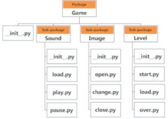
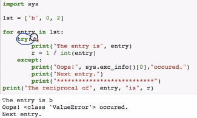
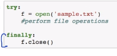
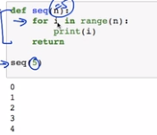
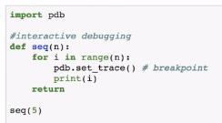

<h1>Core AIM</h1>
    Buuilding Portfolio ( proof of studies )

    Machine Learning , Data Science Jobs

Reference Profiles Of Data Scientists, ML Engg, ...<br/>
https://www.linkedin.com/in/karthik-kumar-billa/<br/>
https://www.linkedin.com/in/cadarsh88/


5pm

Its breadth of knowledge that I look at in python 


Basic installation for python 

    Anaconda package installed with Python3.6

Will also be using jupyter notebook, which will be installed as package with Anaconda


pip install pandas matplotlib nltk numpy scipy scikit-learn seaborn <br/>
pip install --upgrade tensorflow<br/>
pip install keras Pillow plotly<br/>


Why learn Python?<br/>

	- Python is very simple to pick up;
	- Python is much more general purpose programming language;


# Chapter 2:	Python for Data Science Introduction

## Keywords and identifiers
Keywords:
	Keywords are the reserved words in python;

	We can’t use a keyword as variable name, function name or any other identifier;

	Keywords are case sensitive;

        [Import keyword]

	Example: False, None, True, class, if, else, return, def, try, while, for, etc

	Total number of keywords: 33

Identifiers:Name given to entities like class, functions and variables
	
	Can be a combination of letters, digits and underscores, cannot start with a digit

	Keywords cannot be used as identifiers, special characters cannot be used

	Python has straight forward Error indications;


### 1 september 2020


## Comments, indentations and statements
Start a line with a # or use triple quotes, ‘’’ 		‘’’

Indentations are used (4 spaces preferred) to make blocks of code, a for loop

Rather than writing code in a single line try to write in multiple lines (can use \) to make code readable

The written instructions are called statements


Variables and data types in python

Variable is a location in memory used to store some data; Variable declaration is not needed

a, b = 10, ‘Hi’

id(a) prints location of a

Data types:

	Everything in python is an object;

	Number: Integers, float and complex

	Boolean: True and False

	Strings: Sequence of Unicode characters, defined with quotes, indexable, slicable

List: An ordered sequence of items, like an array, can have multiple data type elements, defined with square brackets; Lists are mutable

Tuple: Defined with parenthesis, can have multiple data type elements, tuple is immutable, can be indexable

Set: Defined with Curly braces, Set is an unordered collection of unique items; behaves as a set in mathematics; does not support indexing

Dictionary: an unordered collection of key-value pairs, defined with curly braces and a colon, value accessible with key

Data types can be converted provided the value is valid in both data types;

List(‘Hello’) = [‘H’,’e’,’l’,’l’,’o’]


Standard input and output
	Output: 	print()
			print(‘ {} {}’.format(a,b))
			print(‘ {a} {b}’.format(a = 1, b = 2))
	Input:		input()


Operators
	Operators are special symbols in python that allow arithmetic or logic computation. 
	2 + 3 : + is an operator and 2, 3 are operands
Types: Arithmetic, Comparison, Logical, Bitwise, Assignment, Special
Arithmetic: +, -, *, /, %, //, ** (addition, subtraction, multiplication, division, modulo division, floor division, exponent)
		15, 2: +: 17, - : 13, *: 30, /: 7.5, %: 1 (remainder), //: 7, **: 225;
		-15//2 = -8
	Comparison: <, >, !=, ==, >=, <=
	Logical: and, or, not
	Bitwise: 
		a= 10, b = 4:
			a & b: 1010 & 0100: 0000 (and) = 0
			a | b: 1110 = 14
			or: |, not: -, xor: ~, rightshift: >>, leftshift: <<
			a>>b: 
	Assignment operator:
		=, +=, -=, *=, /=, %=, //=, **=, &=, |=
		a += 10: a = a + 10
	Identity operators:
		is, is not
	Membership operators:
		In, not in


## Control flow: if else
	If test expression:
		statement(s)
	Example:	num = 10
			if num>0:
				print(“number is positive”)
			elif num ==0:
				print(“zero”)
			else:
				print(“number is negative”)
			print(“always printed”)


## Control flow: while loop
	While loop: block of code runs until a test expression is true;
	lst = [10, 20, 30, 40, 50]
	index = 0
	while index < len(lst):
		product * = lst[index]
		index += 1 # increment statement is important
	0: 1*10, 1: 10*20, 2: 200*30,…
	We can use an else block when the test condition fails;


## Control flow: for loop
	Used to iterate over a sequence;
	for element in sequence:
		statement(s)
	for ele in lst:
		product *=ele
	range(): range(10) will generate a list of 10 numbers from 0 to 9;


## Control flow: break and continue
	for var in sequence:
		if condition:
			break


# Chapter 3:	Python for Data Science: Data Structures

## Lists
	Data Structures: collection of data elements
List: Sequence data structures, these are indexable, mutable, defined by square brackets and elements are comma separated
Operations on list:
	len(list), append(element), insert(index, element), remove(element) (removes first occurrence only), list.append(element), list.extend(list), pop(index)
	[‘one’, ’two’].append([‘one’, ’two’]) = [‘one’, ’two’, [‘one’, ’two’]] 
	[‘one’, ’two’].extend([‘one’, ’two’]) = [‘one’, ’two’, ‘one’, ’two’] 
	del lst[1]
	list reverse: list.reverse()
	sorted(list), list.sort()
	lst = [1, 2, 3, 4, 5]; abc = lst; abc.append(6); print(lst)  [1, 2, 3, 4, 5, 6]
•	lst and abc are pointers;
	string.split(‘ ‘)
	lst[index]
	lst[slice_index_start: slice_index_end]
	lst1 + lst2
	lst.count()
	for ele in lst: print(ele)
	List comprehensions: [i**2 for i in range(10) if i%2 ==0]
•	[[row[i] for row in matrix] for i in range(4)]


## Tuples part 1
	A tuple is similar to list; Tuple is immutable, its elements cannot be altered;
-	T = “abcd”, # comma is important to create a tuple
-	Tuple access: T[1]
-	Changing a tuple: a list in a tuple is mutable;
-	Concat tuples using +
## Tuples part 2
- Deletion: whole tuple will be deleted
- Tuple.count(), tuple.index(element), element in tuple, element not in tuple, len(tuple), sorted(tuple), min(tuple), max(tuple), sum(tuple)


## Sets
	Sets are unordered collection of unique items; Mutable, non-indexable;
	S = {1, 2, 3}
	Sets does not allow duplicate numbers;
	set([1,2,3,1]) = (1, 2, 3)
Operations: set.update(elements or sets), set.discard(element), set.remove(element), set.pop(), s.clear()
	Set1 | Set2: Union; Set1.union(Set2)
	Set1 & Set2, Set1.intersection(Set2)
	Set1 – Set2, Set1.difference(Set2)
	Set1^Set2, Set1.symmetric_difference(Set2)): Union - Intersection
		Frozenset: immutable sets: Set1 = frozenset([1,2,3,4])


## Dictionary
	An unordered collection of key value pairs;
O(1) for time complexity for search tasks;
Dictionary is mutable;
Operations: dict.pop(key), dict.clear(), dict.fromkeys(list, values), dict.items(), .keys(), .values(), .copy()
	Dictionary Comprehension:
		for pair in d.items(): print(pair)
		{k:v for k,v in d.items() if v>2}
		{k:v for k+’c’,v*2 in d.items() if v>2}


## Strings
	Sequence of characters: (Unicode (default) or ASCII)
	S = “kl” or = str(1) 
	Access characters of a string as a list;
	Strings are immutable;
	Operations: str1+str2; for i in string: ______; 
	lower(), upper(), join(), split(), find(), replace()
	“Bad Morning”.replace(“Bad”, “Good”)

	Palindrome:
		Mystr = “MaDam”
		Mystr = Mystr.lower()
		revStr = reversed(Mystr)
		if list(Mystr) == list(revStr):
			print(“Palindrome”)
		else:
			print(“Not palindrome”)
	Alphabetic sort:
		Word = word.split().sort()


# Chapter 4:	Python for Data Science: Functions

## Introduction Functions:	
	a group of related statements that perform a specific task;
	Converts a program into smaller chunk which makes management easy
		def function():
			‘’’
			Doc string
			‘’’
			statements
			return
	Doc strings is written to explain the working of the function (function.__doc__)
	Scope and Life Time of Variables:	Portion of the code where the variable is recognized and Lifetime is the period throughout which the variable exists in memory
	Variable inside a function are local variables which are destroyed once the function finishes execution; Global variables are not destroyed unless deleted;
	Program to print highest common factor (HCF): 
		
	def computeHCF(a, b):
		“””
		Computing HCF of two numbers
		“””
		Smaller =b if a>b else a
		hcf = 1
		for i in range(1, smaller + 1):
			if (a%i==0) and (b%i==0):
				hcf = i 
		return hcf

## Built-in Functions and User defined functions;
	Built-in: abs(), all(), any(), dir(), divmod(), enumerate(), filter(), map(), reduce(), isinstance(), 
		enumerate(): returns a list with an index
	filter(): applies a function on a list to reduce the list
	map(): applies a function on all items of a list
		def PowerOfTwo(num):
			Return num**2
		map(PowerOfTwo, list)
		reduce(): applies a computation and returns a result; 
	
	map filter reduce does rolling computation for sequential pairs of values in list


## Function arguments
	Functions need inputs which take in values through arguments;
	Default arguments: to give default values to a function;` have default arguments at the end
	Keyword arguments: variable number of arguments can be given as input;
	Arbitrary arguments: Used when number of arguments are unknown given as input to the function;


## Recursive functions
	Function calling inside itself;
	Factorial(n) = n*Factorial(n-1)
	Stack of function calls; Makes code clean, hard to debug;


## Lambda functions
		Functions without name; used along with filter and map
		Def Double(x):
			return x*2
	Can also be defined as:
	Double = lambda x : x*2
		Example: list(filter(lambda x : (x%2==0), [1,2,3,4,5])); Output: [2, 4]
		reduce(lambda x, y : x* y, [1, 2, 3, 4, 5])


## Modules
		Module refers to file containing statements and definitions;
		A .py file containing code that is used in other programs
		Module: example.py
			import example
	-	import math
	-	math.pi
			import math as m
			import datetime
	Module is basically a file which contains classes and functions.
	Package is a kind of directory which contains modules of similar type.
	Library is a collection of Packages.
	Framework is collection of Libraries.
	Use dir() to get all names functions inside the module


## Packages
	__init__.py needs to be present in a folder to consider the folder as a package;
	Packages contain modules;

	```python
    	 # python code
    	import Game.Sound.play
	````


<!--   -->




## File Handling

	Storing data in hard disk which is non-volatile:
	Open, read and close
	File = open(‘example.txt’)
	File can be open in different modes:
		‘r’, reading (default)
		‘w’, writing (creates a new file, if exists deletes it)
		‘a’, appending
	Closing a file:
	File.close() # to make sure the data is not volatile
	
	Use safer “try finally” block: Exception handling
	import os	
    os.mkdir(‘test’)
    	os.rmdir(‘test’) # does not remove if test is not empty
    	import shutil
    	shutil.rmtree(‘test’) # removes non-empty folders


<br/><br/>

## Exception Handling

Whenever an error is observed, python interpreter raises an error;
	Use:
	 


	Raising exceptions:
		For example: Memory error
	 

Finally block runs at the end of all operations, such as closing the file even if the file is not written, to save data.


<br/><br/><br/>


## Debugging Python
	Python debugger: pdb	





	Comes to pdb.set.trace at every iteration, requires string input to give results


<br/><br/><br/>


## Note!
<p  style="font-size: 30px">Please start checking the folder numpy pandas matplotlib algo . . .</p>


